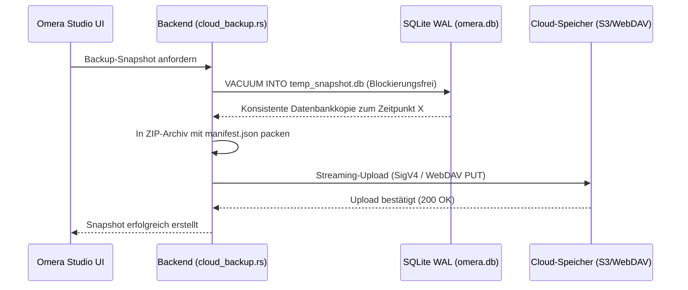

# Cloud-Snapshot-Backup & Medienspiegelung

Omera verfügt über integrierte Module für Cloud-Backups und Delta-Synchronisation (`src-tauri/src/cloud_backup.rs` und `src-tauri/src/cloud_sync.rs`), die automatisierte Datenbanksicherungen und inkrementelle Medienspiegelungen ohne externe Hilfswerkzeuge ermöglichen.

---

## 1. Unterstützte Speicheranbieter

Konfigurieren Sie Remote-Endpunkte unter **Einstellungen > Cloud & Backup**:

| Anbieter | Unterstützte Protokolle / Endpunkte | Besonderheiten |
| :--- | :--- | :--- |
| **AWS S3 / Kompatibel** | AWS S3, Cloudflare R2, MinIO, Backblaze B2, Wasabi | Reine Rust-basierte AWS Signature Version 4 (SigV4)-Authentifizierung mit HMAC-SHA256-Signierung. |
| **WebDAV** | Nextcloud, ownCloud, Synology DiskStation, QNAP NAS | Standardmäßige HTTP-Basic-Authentifizierung über verschlüsseltes HTTPS. |
| **Lokales / Netzwerkverzeichnis** | Lokale Laufwerke, externe USB-SSDs, SMB- / NFS-Netzwerkfreigaben | Direkte, extrem schnelle Dateisystem-E/A ohne Protokoll-Overhead. |

---

## 2. Konsistente SQLite-Snapshots im laufenden Betrieb (`cloud_backup_create_snapshot`)

Omera sichert Ihre Datenbank über den nativen SQLite-Befehl `VACUUM INTO`:

### Snapshot-Garantien:
- **Blockierungsfrei (Non-Locking)**: Nutzt die Online-Vacuum-API von SQLite. Sie können ohne Unterbrechung weiter in der Galerie arbeiten, bewerten und Bilder generieren.
- **Rollback-Sicherheit**: Beim Wiederherstellen eines Snapshots erstellt Omera automatisch eine lokale Sicherheitskopie (`omera.db.rollback`), bevor die Remote-Datenbank eingespielt wird. Dies schützt vor Netzwerkabbrüchen oder beschädigten Downloads.

---

## 3. Inkrementelle Medienspiegelung & Delta-Sync (`cloud_sync.rs`)

Während Snapshots Ihre Datenbankstruktur und Metadaten sichern, bietet der **Delta-Sync** eine einseitige inkrementelle Upload-Spiegelung physischer Bild- und Videodateien aus Ihrer lokalen Bibliothek auf Remote- oder Netzwerkspeicher.

### Synchronisationsfähigkeiten (Implementiert):
- **Strategien zur Änderungserkennung**:
  - *Schneller Fingerabdruck*: Vergleicht die lokale Dateigröße mit der Remote-Dateigröße über HTTP-HEAD-Metadaten (besonders schnell bei langsameren Verbindungen).
  - *Strikte Prüfsumme*: Berechnet lokale SHA-256-Prüfsummen zum Abgleich mit Remote-Headern (benutzerdefinierter `x-amz-meta-sha256`-Header auf S3) für garantierte Byte-für-Byte-Konsistenz.
- **Bandbreitenbegrenzung (Token-Bucket)**: Legen Sie ein Upload-Limit (KB/s) fest, damit Hintergrundübertragungen die Internetleitung Ihres Studios nicht blockieren.
- **Übertragungs-Threads (Worker Concurrency)**: Konfigurierbare Thread-Anzahl (1 bis 16 parallele Uploads, Standard 4).
- **Testlauf-Modus (Dry-Run)**: Simuliert den Abgleich und meldet hochzuladende und zu überspringende Dateien, ohne Daten auf dem Remote-Speicher zu verändern.
- **Echtzeit-Fortschrittsanzeige**: Sendet kontinuierliche Status-Updates mit übertragenen Bytes, Durchsatzrate, Prozentsatz und geschätzter Restzeit (ETA) sowie atomarer kooperativer Abbruchunterstützung.

### Aktuelle Einschränkungen & Geplante Funktionen:
- **Nur unidirektionaler Upload**: Der aktuelle Synchronisationspfad lädt lokale indizierte Dateien zum Remote-Ziel hoch. Ein Herunterladen/Abgleich von Remote nach Lokal ist nicht implementiert.
- **Keine Synchronisation von Löschungen**: Lokal gelöschte Dateien werden auf dem Remote-Speicher nicht gelöscht; Remote-Dateien bleiben erhalten.
- **Kein ETag-basierter Delta-Abgleich**: Die Änderungserkennung nutzt Dateigröße und SHA-256; HTTP-ETags werden nicht zur Cache-Invalidierung ausgewertet.
- **Geplante bidirektionale Synchronisation**: Eine vollständige bidirektionale Synchronisation mit Erkennung von Remote-Änderungen, Pull-Downloads und Konfliktlösungsrichtlinien ist für zukünftige Versionen geplant.
