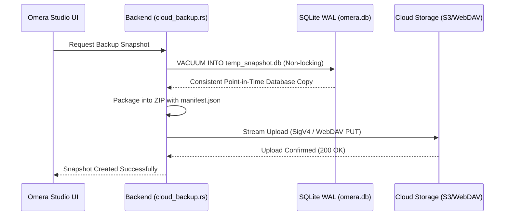

# Cloud Snapshot Backup & Media Mirroring

Omera includes a cloud backup and delta sync engine (`src-tauri/src/cloud_backup.rs` and `src-tauri/src/cloud_sync.rs`) that enables automated database backups and incremental remote media mirroring without third-party tools.

---

## 1. Supported Storage Providers

Configure remote endpoints in **Settings > Cloud Backup**:

| Provider | Supported Protocols / Endpoints | Notes |
| :--- | :--- | :--- |
| **AWS S3 / Compatible** | AWS S3, Cloudflare R2, MinIO, Backblaze B2, Wasabi | Pure-Rust AWS Signature Version 4 (SigV4) authentication with HMAC-SHA256 signing. |
| **WebDAV** | Nextcloud, ownCloud, Synology DiskStation, QNAP NAS | Standard HTTP Basic Authentication over HTTPS. |
| **Local / Network Path** | Local drive, external USB SSD, SMB / NFS network shares | Direct high-speed filesystem I/O without network protocol overhead. |

---

## 2. Hot SQLite Snapshot Backups (`cloud_backup_create_snapshot`)

Omera backs up your database using SQLite's native `VACUUM INTO` command:

### Snapshot Guarantees:
- **Non-Locking**: Uses SQLite's online vacuum API. You can continue browsing, rating, and generating images without interruption.
- **Rollback Safety**: When restoring a snapshot, Omera creates an automatic local safety copy (`omera.db.rollback`) before applying the remote snapshot, protecting against network drops or corrupted downloads.

---

## 3. Incremental Media Mirroring & Delta Sync (`cloud_sync.rs`)

While snapshots protect your database, **Delta Sync** provides one-way incremental upload mirroring of physical image and video files from your local library to remote cloud or network storage.

### Sync Capabilities (Shipped):
- **Change Detection Strategies**:
  - *Fast Fingerprint*: Lightweight comparison without reading entire files.
    - **LocalPath**: Compares file size AND modification time (mtime). Detects same-length content changes when local mtime is newer than remote.
    - **S3/WebDAV**: Compares file size AND ETag presence as a weak content fingerprint.
    - **Guarantees**: Detects size changes immediately. For LocalPath, detects content changes via mtime. For S3/WebDAV, ETag presence indicates synchronized state.
    - **Limitations**: LocalPath may miss same-length changes with backdated or equal mtime. S3/WebDAV relies on ETag availability; missing ETag triggers re-upload. Not cryptographically secure.
  - *Strict Checksum*: Computes local SHA-256 hashes to verify against remote hashes (custom `x-amz-meta-sha256` header on S3, full download for WebDAV) to guarantee byte-for-byte fidelity. Cryptographically verifies content equality but reads entire files.
- **Token-Bucket Bandwidth Limiter**: Set an upload speed ceiling (KB/s) so background cloud syncing does not saturate your studio's internet bandwidth.
- **Worker Concurrency**: Configure upload thread counts (1 to 16 threads, default 4).
- **Dry-Run Mode**: Simulates sync execution and reports files to upload or skip without modifying remote storage.
- **Live Progress Reporting**: Emits real-time progress events showing transferred bytes, throughput speed, percentage complete, and ETA, with cooperative atomic cancellation.

### Current Limitations & Planned Capabilities:
- **Upload-Only Mirroring**: Current runtime synchronizes local indexed files to the remote target. Remote-to-local pull/download reconciliation is not implemented in the current runtime.
- **No Remote Deletion Sync**: Local file deletions do not delete remote objects; remote storage retains uploaded media.
- **Planned Bidirectional Sync**: Full two-way reconciliation with remote change detection, download pulls, and conflict resolution policies is planned for future releases.
