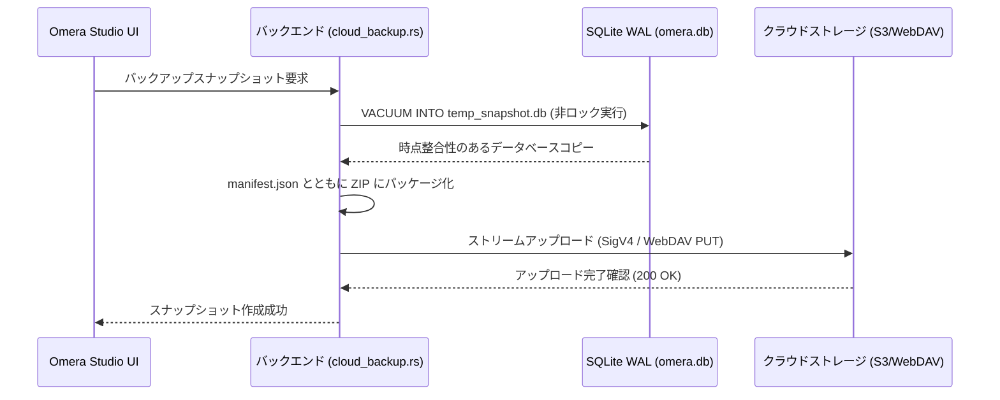

# クラウドスナップショットバックアップと同期

Omera は、クラウドバックアップおよび差分同期エンジン（`src-tauri/src/cloud_backup.rs` および `src-tauri/src/cloud_sync.rs`）を標準搭載しており、サードパーティ製ツールに頼ることなく、データベースの自動バックアップとリモートへの増分メディアミラーリングを実現します。

---

## 1. 対応ストレージプロバイダー

リモートエンドポイントは **環境設定 > クラウドバックアップ** で設定できます：

| プロバイダー | 対応プロトコル / エンドポイント | 特徴・備考 |
| :--- | :--- | :--- |
| **AWS S3 / 互換ストレージ** | AWS S3, Cloudflare R2, MinIO, Backblaze B2, Wasabi | HMAC-SHA256 署名による Rust ネイティブの AWS Signature Version 4 (SigV4) 認証。 |
| **WebDAV** | Nextcloud, ownCloud, Synology DiskStation, QNAP NAS | HTTPS 経由の標準 HTTP Basic 認証に対応。 |
| **ローカル / ネットワークパス** | ローカルドライブ、外付け USB SSD、SMB / NFS ネットワーク共有 | ネットワークプロトコルのオーバーヘッドがない直接の高速ファイルシステム I/O。 |

---

## 2. ホット SQLite スナップショットバックアップ (`cloud_backup_create_snapshot`)

Omera は、SQLite ネイティブの `VACUUM INTO` コマンドを使用してデータベースのバックアップを作成します：

### スナップショットの保証事項：
- **ノンブロッキング（非ロック）**: SQLite のオンライン Vacuum API を使用するため、バックアップ中も閲覧、評価、画像生成を一切中断することなく継続できます。
- **ロールバック保護**: リモートスナップショットを復元する際、Omera は適用前にローカルの安全なコピー（`omera.db.rollback`）を自動作成し、ネットワーク切断やデータ破損から保護します。

---

## 3. 増分メディアミラーリングと差分同期 (`cloud_sync.rs`)

スナップショットがデータベースを保護する一方、**差分メディアミラーリング（Delta Sync）** はローカルライブラリからリモートクラウドまたはネットワークストレージへの物理画像・動画ファイルの単方向増分アップロードミラーリングを提供します。

### 同期エンジンの機能（実装済み）：
- **差分比較戦略**:
  - *高速フィンガープリント*: ローカルのファイルサイズとリモートのファイルサイズを HTTP HEAD メタデータで比較（低速回線に最適）。
  - *厳密なチェックサム*: ローカルで SHA-256 ハッシュを計算し、リモートのハッシュ（S3 のカスタム `x-amz-meta-sha256` ヘッダー）と照合して完全一致を保証。
- **トークンバケット帯域幅制限**: アップロード速度の上限（KB/s）を設定可能。バックグラウンドでの同期処理がスタジオのインターネット回線を占有するのを防ぎます。
- **並行転送スレッド数**: アップロードスレッド数を 1〜16 スレッド（デフォルト 4）の間で調整可能。
- **ドライランモード (Dry-Run)**: リモートストレージを変更することなく、アップロード対象およびスキップ対象のファイルを事前にシミュレーション確認。
- **リアルタイム進捗通知**: 転送バイト数、スループット速度、完了パーセント、予想残り時間（ETA）をリアルタイムで画面に通知し、アトミックな協調キャンセルに対応。

### 現在の制限事項および計画機能：
- **単方向アップロードのみ**：現在の同期パスはローカルのインデックス済みファイルをリモートへアップロードする単方向ミラーリングです。リモートからローカルへのプル/ダウンロード同期は未実装です。
- **リモート削除の非同期**：ローカルで削除したファイルがリモートから自動削除されることはなく、リモートのデータは保持されます。
- **ETag 差分ロジックの不使用**：変更検知にはファイルサイズと SHA-256 ヘッダーを使用し、プロバイダの HTTP ETag によるキャッシュ無効化は使用していません。
- **計画中の双方向同期**：競合調停、リモート変更検知、差分プルを備えた双方向同期は今後のリリースで計画されています。
